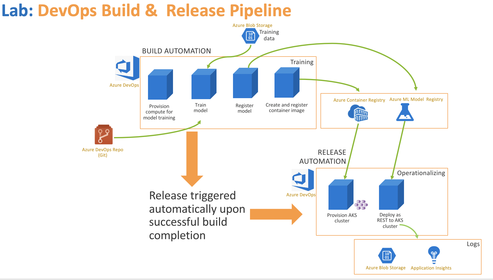
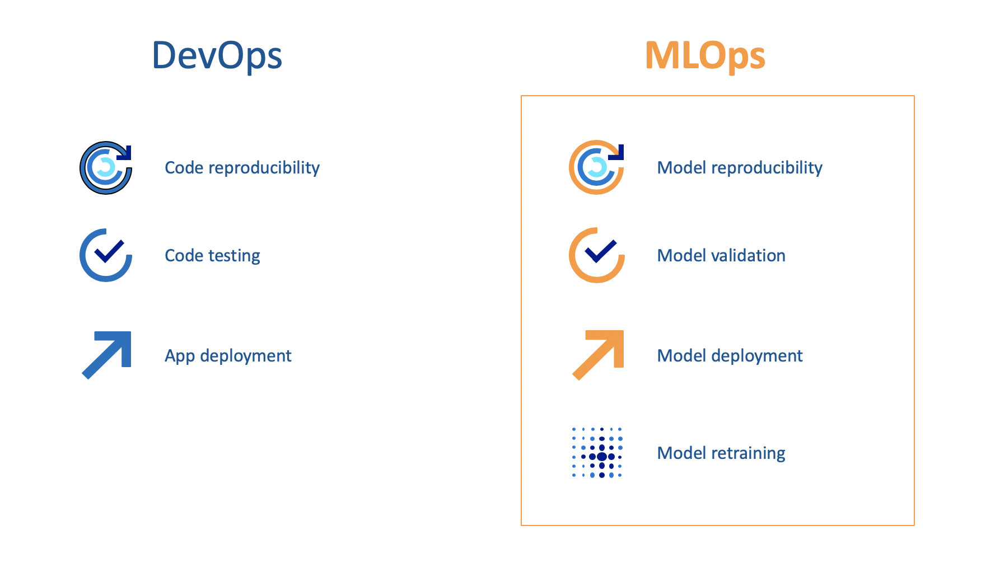
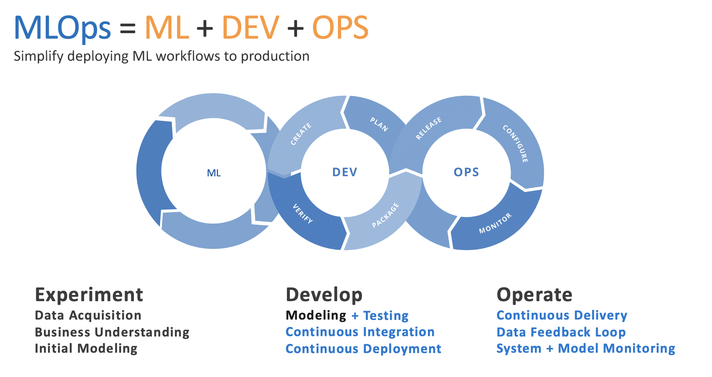
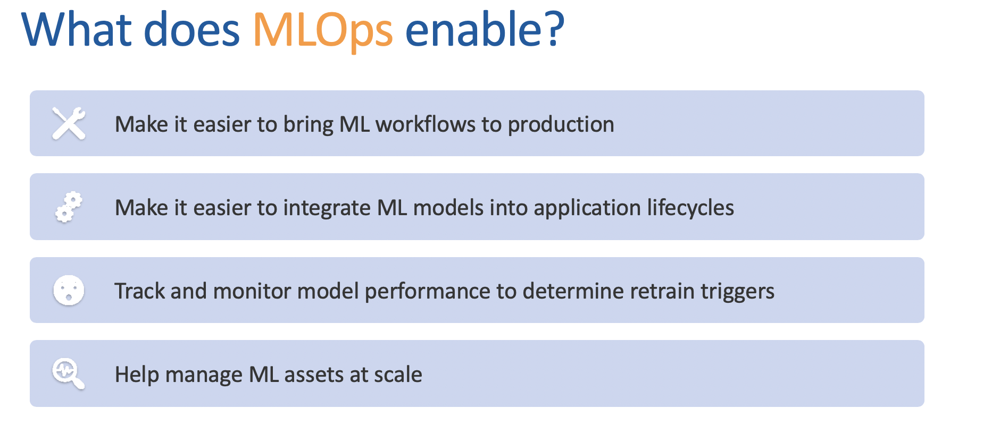
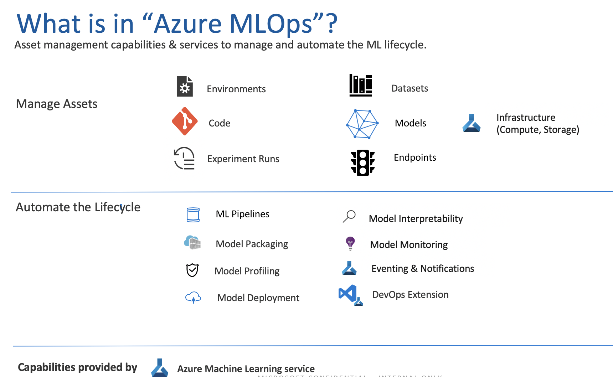
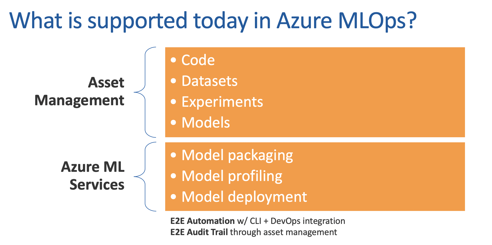

## 1.  About

There are a lot of labs in GitHub for MLOps.  This one was purpose-built as part of a learning experience, and with granular instructions with much cross-referencing of DevOps pipeline execution with assets getting created/provisioned/deployed in your Azure Machine Learning (AML) workspace, for beginners, to make the journey a little easier. 

What you can expect to get out this lab:
1.  Learn manual portal-based provisioning - storage, AML, Azure DevOps
2.  Learn a simple machine learning experiment if you dont have this background - run on Jupyter notebook in an AML workspace 
3.  Take #2 a step further, with AML integration
4.  Import MLOps code from the lab git repo into your DevOps project
5.  Create and execute a build pipeline - provisions transient training compute, does remote model training, checks model into AML model registry, creates a container image, checks it into the container registry, publishes a build artifact
6.  Create and execute a release pipeline - provisions an AKS cluster, operationalize model in #5, to a REST service
7.  Test the REST service
8.  Complete an end to end execution by editing code and committing to master branch
9.  Complete the challenge - time permitting

 

 

Credits are at the bottom of this page, thanks to all who helped.  Help improve this lab by contributing to it.

## 2.  Audience

North Central Region Solution Architects, and anyone who wants to try out MLOps on Azure, even basics such as (delibrately manual) provisioning is included.  

## 3.  Time and resources committment

If you are new to Machine Learning, Azure Machine Learning and Azure DevOps, dedicate at least two-three days for it to run slowly, and understand each step.  Otherwise, you can finish the lab in a few hours.  You will need an Azure subscription with at least a few hundred dollars.

## 4.  What is MLOps?  

 

 

 

 

 

 

 

 

 

 

## 5.  What would a data scientist need to know and do, for MLOps? What is the handoff between the data scientist and a DevOps engineer?

## 6.  Related collateral

MLOps code is in a different git repo, referenced in the modules.
 
## 7.  Lab modules

## 8.  Credits

Inspired by, and some of the code base from:
1.  MCW MLOps 
2.  Azure MLOps samples - Pranith and other in the product team

Thanks to:
1.  Michael Kareev, data scientist - for the machine learning experiment 
2.  Dr. Thomas Abraham - for the data science related guidance as it relates to this workshop, testing and authoring some modules, and being my go-to person for all things data science on Azure.

