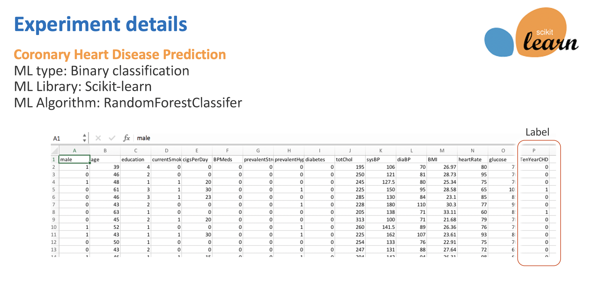
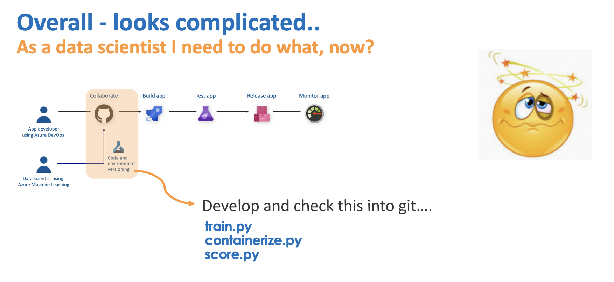
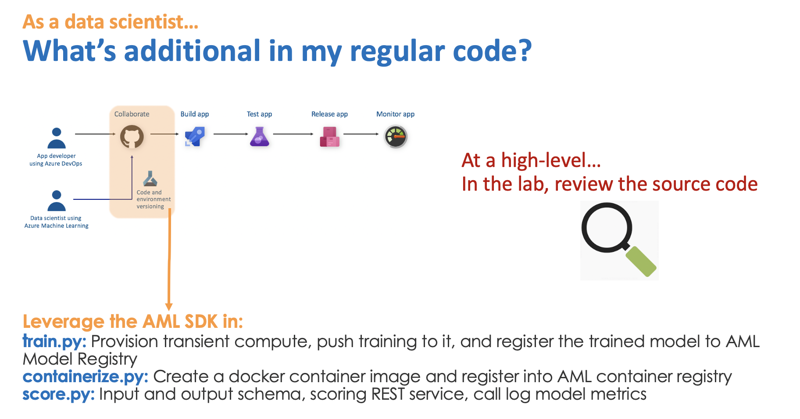

## 1.  About

There are a lot of labs in GitHub for MLOps.  This one was purpose-built as part of a learning experience, and with granular instructions with much cross-referencing of DevOps pipeline execution with assets getting created/provisioned/deployed in your Azure Machine Learning (AML) workspace, for beginners, to make the journey a little easier. 

What you can expect to get out this lab:
1.  Learn manual portal-based provisioning - storage, AML, Azure DevOps
2.  Learn a simple machine learning experiment if you dont have this background - run on Jupyter notebook in an AML workspace 
3.  Take #2 a step further, with AML integration
4.  Import MLOps code from the lab git repo into your DevOps project
5.  Create and execute a build pipeline - provisions transient training compute, does remote model training, checks model into AML model registry, creates a container image, checks it into the container registry, publishes a build artifact
6.  Create and execute a release pipeline - provisions an AKS cluster, operationalize model in #5, to a REST service
7.  Test the REST service
8.  Complete an end to end execution by editing code and committing to master branch
9.  Complete the challenge - time permitting

Due to the number of services at play and complexity of concepts, this is a scripted lab to be followed and tried out step-by-step.  There are three challenges at the end of the scripted lab, for those who are Machine Learning savvy and DevOps savvy to make it more fun.

 

 

 

 

Credits are at the bottom of this page, thanks to all who helped.  Help improve this lab by contributing to it. 

This lab was authored in Jan 2020, and is dated in its functionality.  Refer to the Azure docs and samples from the product team for the latest and greatest.

## 2.  Audience

Any Azure Machine Learning enthusiasts who want to try out MLOps on Azure 
(even basics such as (delibrately manual) provisioning is included)  

## 3.  Time and resources committment

If you are new to Machine Learning, Azure Machine Learning and Azure DevOps, dedicate at least two-three days for it to run slowly, and understand each step.  Otherwise, you can finish the lab in a few hours.  You will need an Azure subscription with at least a few hundred dollars.

## 4.  What is MLOps?  

 

 

 

 

 

 

 

 

 

 

## 5.  What would a data scientist need to know and do, for MLOps? What is the handoff between the data scientist and a DevOps engineer?

 

 

 

 

 

 

## 6.  Related collateral

MLOps code is in a different git repo 
https://github.com/anagha-microsoft/ncr-mlops-hol-code
 
## 7.  Lab modules

1.  [Provisioning](https://github.com/anagha-microsoft/ncr-mlops-hol/blob/master/lab-guide/01-Provisioning.md)
2.  [Download Jupyter notebooks and training dataset from Git](https://github.com/anagha-microsoft/ncr-mlops-hol/blob/master/lab-guide/02-DownloadFromGit.md)
3.  [Upload training data](https://github.com/anagha-microsoft/ncr-mlops-hol/blob/master/lab-guide/03-LoadTrainingData.md)
4.  [Upload Jupyter notebooks](https://github.com/anagha-microsoft/ncr-mlops-hol/blob/master/lab-guide/04-UploadJupyterNotebooks.md)
5.  [The machine learning experiment in its basic form](https://github.com/anagha-microsoft/ncr-mlops-hol/blob/master/lab-guide/05-DataScientistTrials.md)
6.  [The same machine learning experiment with Azure Machine Learning service integration ](https://github.com/anagha-microsoft/ncr-mlops-hol/blob/master/lab-guide/06-DataScientistAMLTrials.md)
7.  [Import MLOps code into your DevOps project](https://github.com/anagha-microsoft/ncr-mlops-hol/blob/master/lab-guide/07-DevOps-ImportFromGit.md)
8.  [Configure a DevOps service connection](https://github.com/anagha-microsoft/ncr-mlops-hol/blob/master/lab-guide/08-DevOps-ConfigureServiceConnection.md)
9.  [The MLOps code - explained](https://github.com/anagha-microsoft/ncr-mlops-hol/blob/master/lab-guide/09-DevOps-Files-Explained.md)
10.  [Configure and test a build pipeline](https://github.com/anagha-microsoft/ncr-mlops-hol/blob/master/lab-guide/10-Configure-Build-Pipeline.md)
11. [Configure and test a release pipeline](https://github.com/anagha-microsoft/ncr-mlops-hol/blob/master/lab-guide/11-Configure-Release-Pipeline.md)
12.  [Test the REST service manually in a Jupyter notebook](https://github.com/anagha-microsoft/ncr-mlops-hol/blob/master/lab-guide/12-RESTServiceTestOnJupyter.md)
13.  [Lets do an End-to-End run (build + release)](https://github.com/anagha-microsoft/ncr-mlops-hol/blob/master/lab-guide/13-EndToEndRun.md)
14.  [What else is out there, at the time this lab was authored](https://github.com/anagha-microsoft/ncr-mlops-hol/blob/master/lab-guide/14-WhatElseWhenItComesToAMLAndMLOps.md)

## 8.  Credits

Inspired by, and some of the code base from:
1.  [Azure MLOps samples](https://github.com/microsoft/MLOps) - Parneeth Singh Solanki and others in the product team
2.  [MCW MLOps](https://github.com/solliancenet/MCW-MLOps)

Thanks to:
1.  Dr. Michael Kareev, data scientist - for the machine learning experiment 
2.  Dr. Thomas Abraham - for the data science related guidance as it relates to this workshop, testing and authoring some modules
