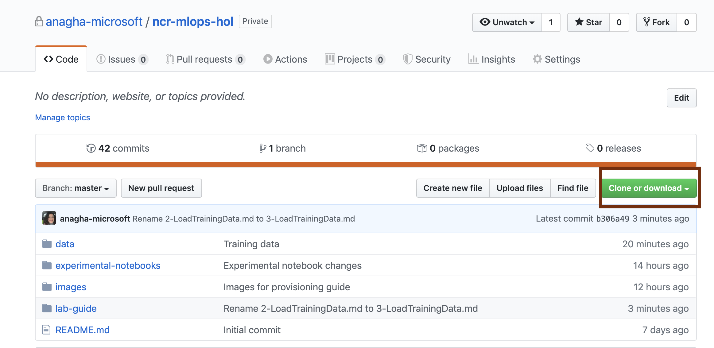
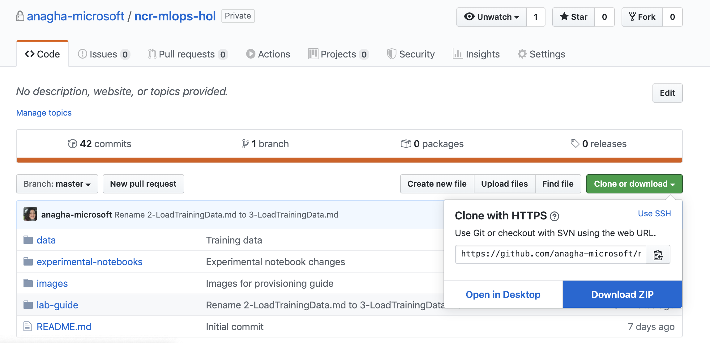
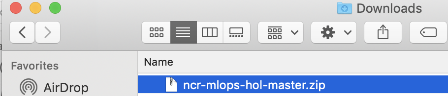
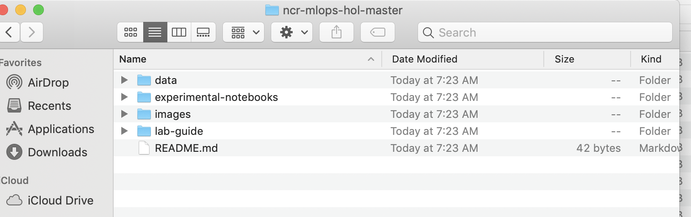
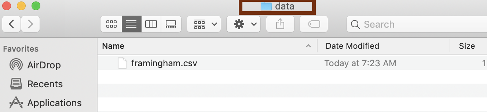
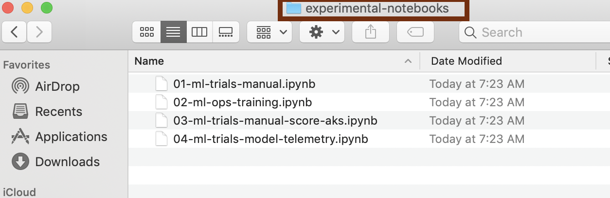

# Module 2 - Code and docs download

## About
This module covers downloading the experimental notebooks and training datasets we will need for the lab.
  Dedicate 5 minutes for this module.

## 1.0. Download from git

 

 

 

 

 

 

## 2.0. Browse content
You will need to upload the training dataset to blob storage, and to upload Jupyter notebooks (experimental notebooks) to the Notebook VM.  Browse and get familiar with the files you downloaded. 

 

 

 

 

 

 

## Recap
Its a wrap for this module.  In this module you learned to donwload the lab source code from git, and familiarized yourself with the same.

## Next

Navigate to the next section of the lab guide that details how to load data into the storage account. 
[Upload training data](https://github.com/anagha-microsoft/ncr-mlops-hol/blob/master/lab-guide/03-LoadTrainingData.md)
