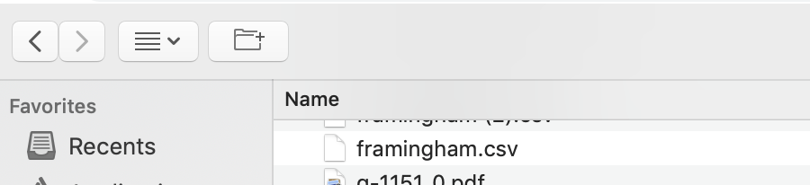
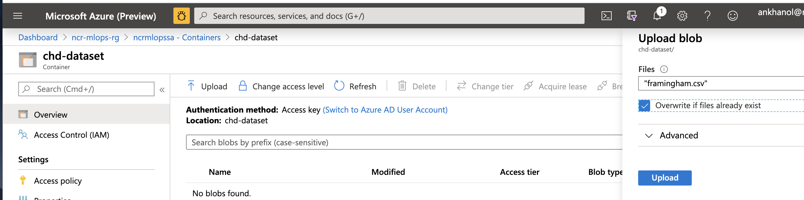
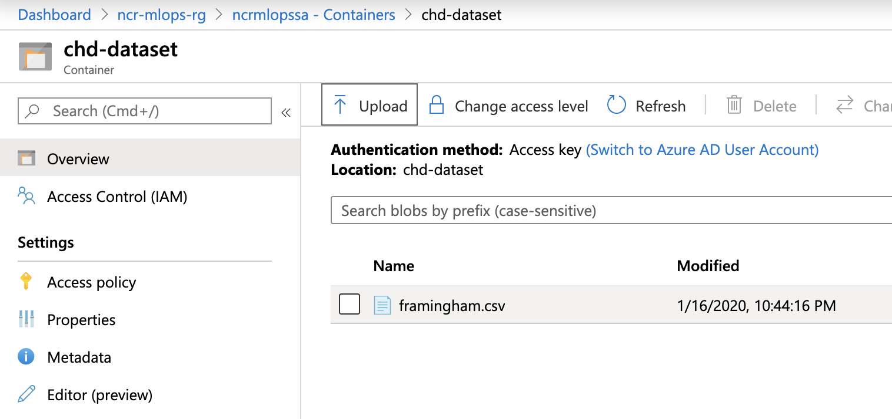
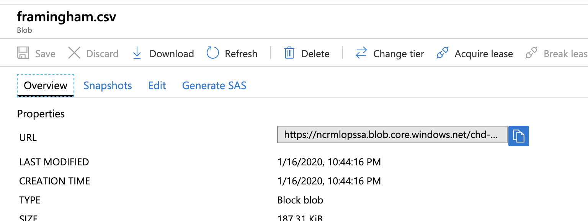

# Module 3 - Upload training data

## About
This module covers loading training data to your storage account.  Its important to have completed the previous section that covers downloading data and notebooks.
  Dedicate 5-10 minutes for this module.

## 1.0. Create a container in your storage account
1. Navigate to the storage account on the portal
2. Create a conatiner as shown in the screenshots below 

 

 

 

 

 

 

Note: For simplicity of the lab, we are going the route of anonymous access.  For an actual project, consult your Microsoft CSA on best practice. 

 

 

 

 

## 2.0. Upload the training dataset to the container

 

 

 

 

 

 

## 3.0. Capture the URL for the data - we will use it later

 

 

## Recap
Its a wrap for this module.  In this module you learned to (1) create a container in your blob storage account, (2) set permissions on it for access from your DevOps/ML code, (3) uploaded the training dataset from the previous module

## Next
Proceed to the next step that covers loading the experimental notebooks into the Notebook VM provisioned in the provisioning section.
