# Module 3 - Upload Jupyter notebooks

## About
This module covers provisioning a Notebook VM and uploading the experimental notebooks it.  Its important to have completed the section that covers downloading data and notebooksn from git.
 

## 1.0. Provision a Notebook VM instance in your Azure Machine Learning Workspace
1. Navigate to your Azure Machine Learning instance on the Azure portal
2. Click on "Compute" in the left navigation panel
3. Create a Notebook VM as detailed below in the diagrams
 

 

 

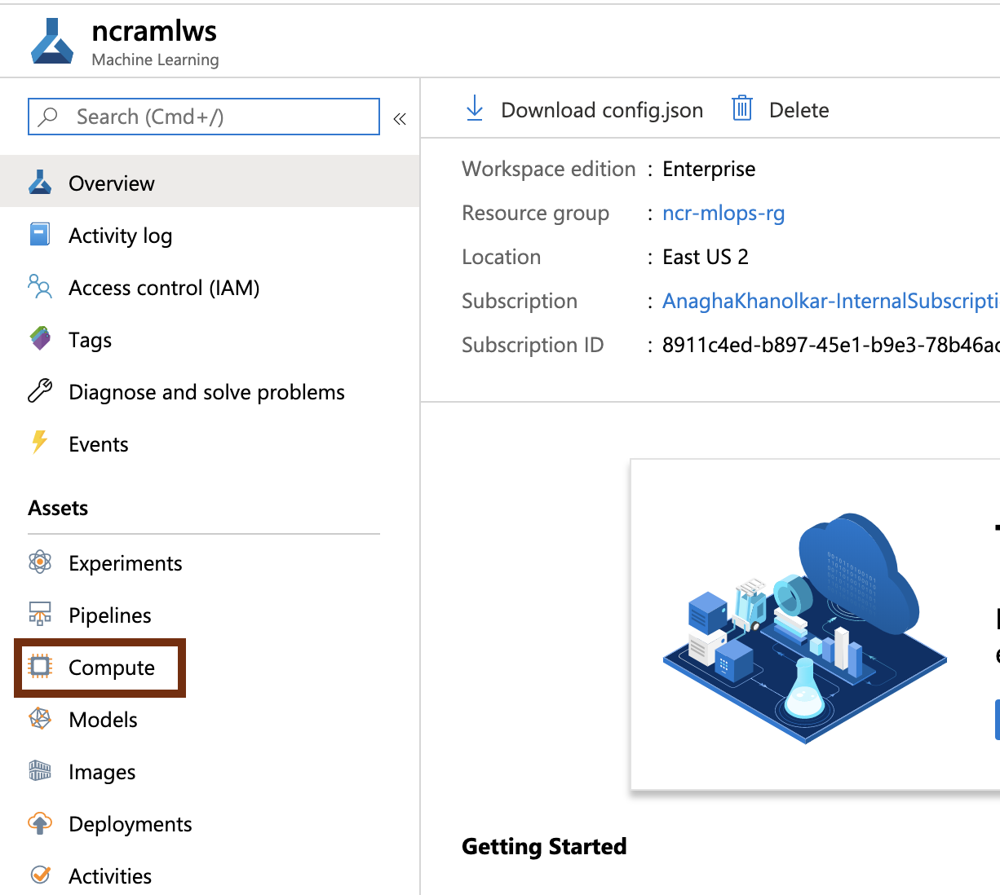
 

 

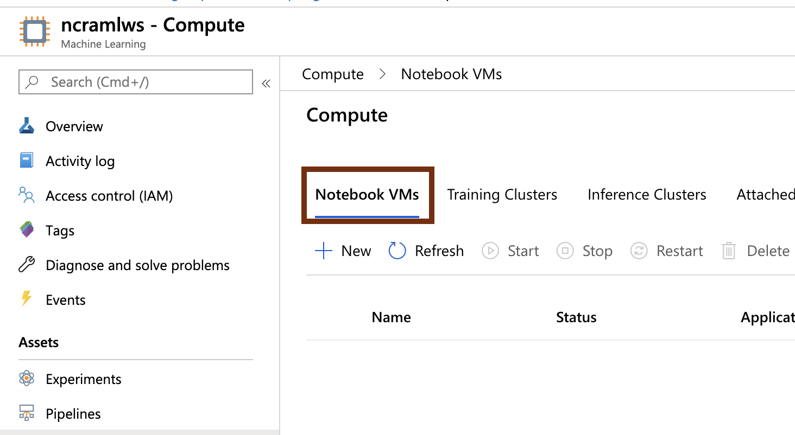
 

 

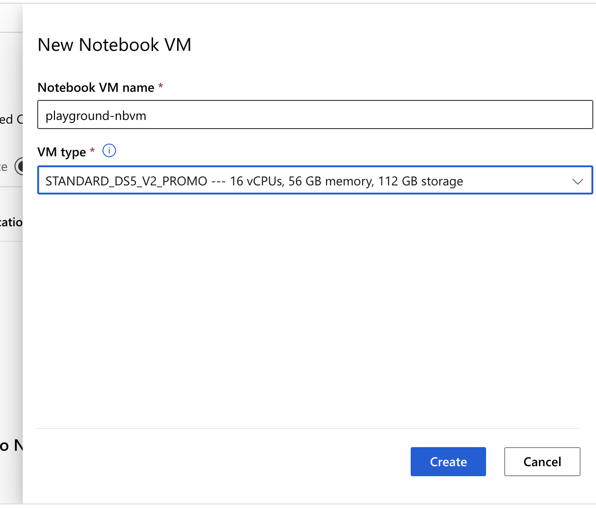
 

 

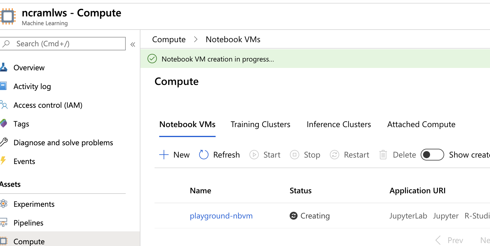
 

 

## 2.0. Launch Jupyter service on the Notebook VM provisioned

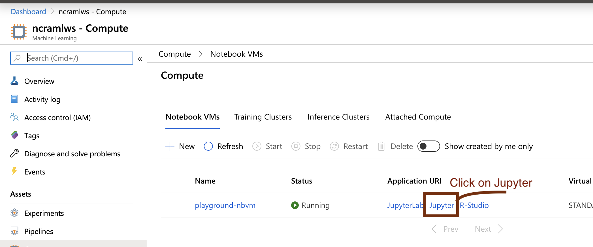
 

 

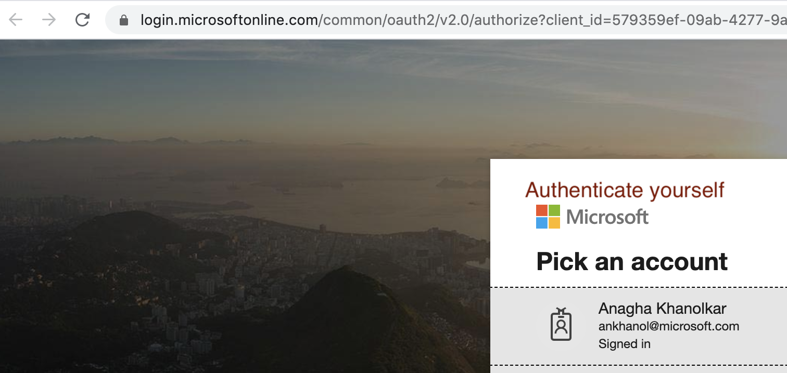
 

 

## 3.0. Upload the notebooks for use in the lab

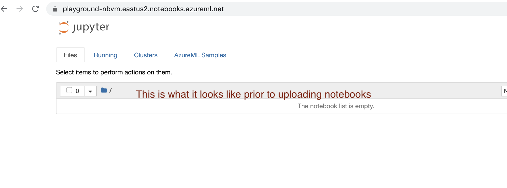
 

 

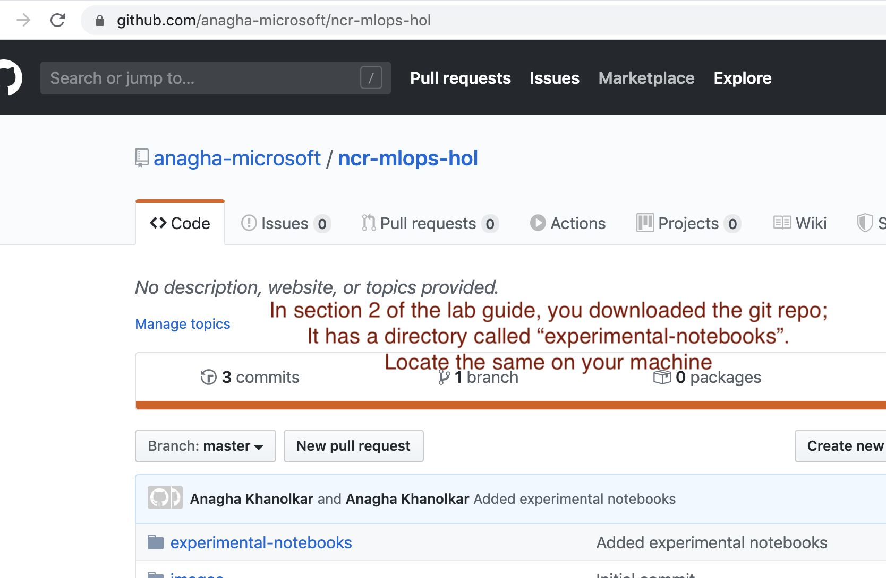
 

 

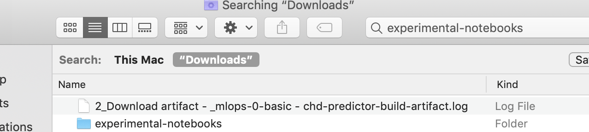
 

 

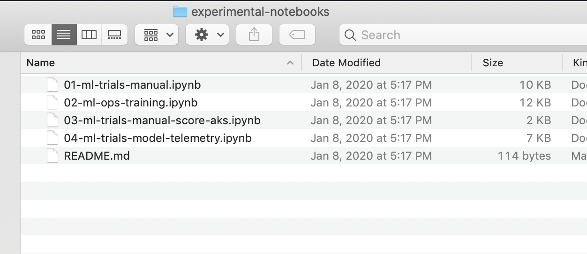
 

 

 

 

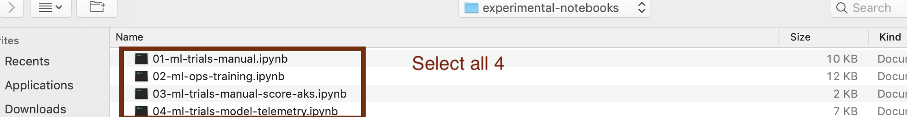
 

 

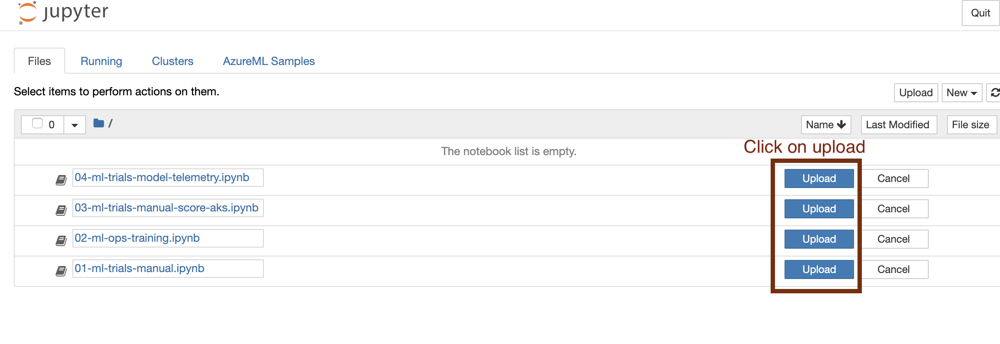
 

 

## Next steps
Move to the next module -> data scientist trials
