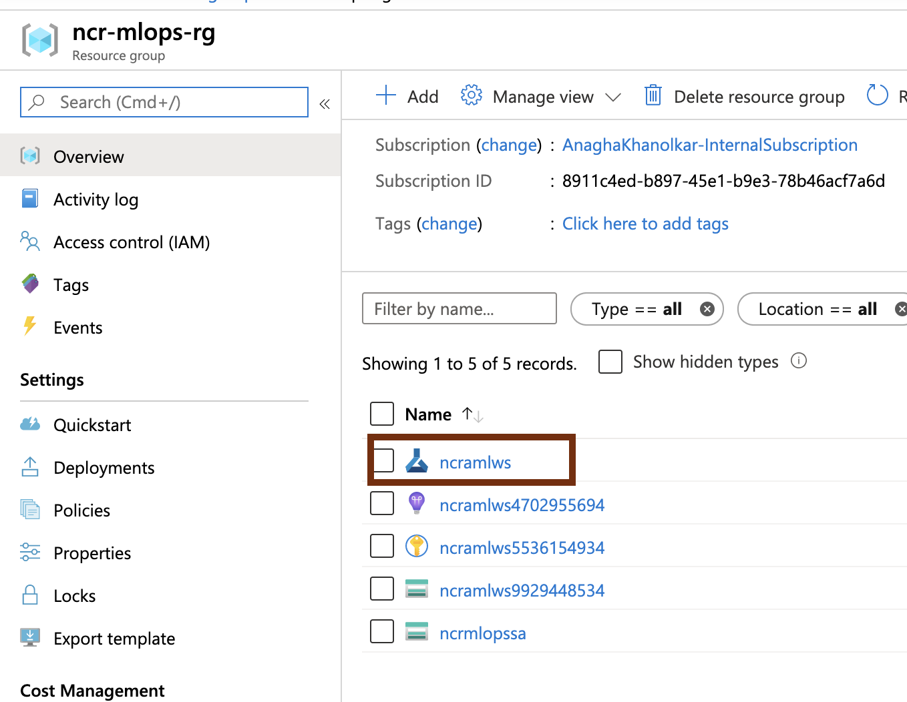

## About
This lab guide section covers review of a model training experiment - in one of the notebooks uploaded in the previous section. 
- The notebook details an entire experiment (model training).  The code is from my data scientist contact - Michael Kareev - formerly a customer contact 
- The dataset is framingham.csv, you downloaded it in section 2;  Its a popular Kaggle open dataset. 
https://www.kaggle.com/amanajmera1/framingham-heart-study-dataset

## 1.0. About the dataset, framingham.csv

**Attributes/columns:**
male: 0 = Female; 1 = Male 
age: Age at exam time 
education: 1 = Some High School; 2 = High School or GED; 3 = Some College or Vocational School; 4 = college 
currentSmoker: 0 = nonsmoker; 1 = smoker 
cigsPerDay: number of cigarettes smoked per day (estimated average) 
BPMeds: 0 = Not on Blood Pressure medications; 1 = Is on Blood Pressure medications 
prevalentStroke 
prevalentHyp 
diabetes: 0 = No; 1 = Yes 
totChol in mg/dL 
sysBP in mmHg 
diaBP in mmHg 
BMI: Body Mass Index calculated as: Weight (kg) / Height(meter-squared) 
heartRate: Beats/Min (Ventricular) 
glucose in mg/dL 
TenYearCHD - label; 0 = No for heart disease, 1 = Yes for heart disease 

## 2.0. About the experiment - 

 

## 1.0. Provision a Notebook VM instance in your Azure Machine Learning Workspace
1. Navigate to your Azure Machine Learning instance on the Azure portal
2. Click on "Compute" in the left navigation panel
3. Create a Notebook VM as detailed below in the diagrams
 

 

 
