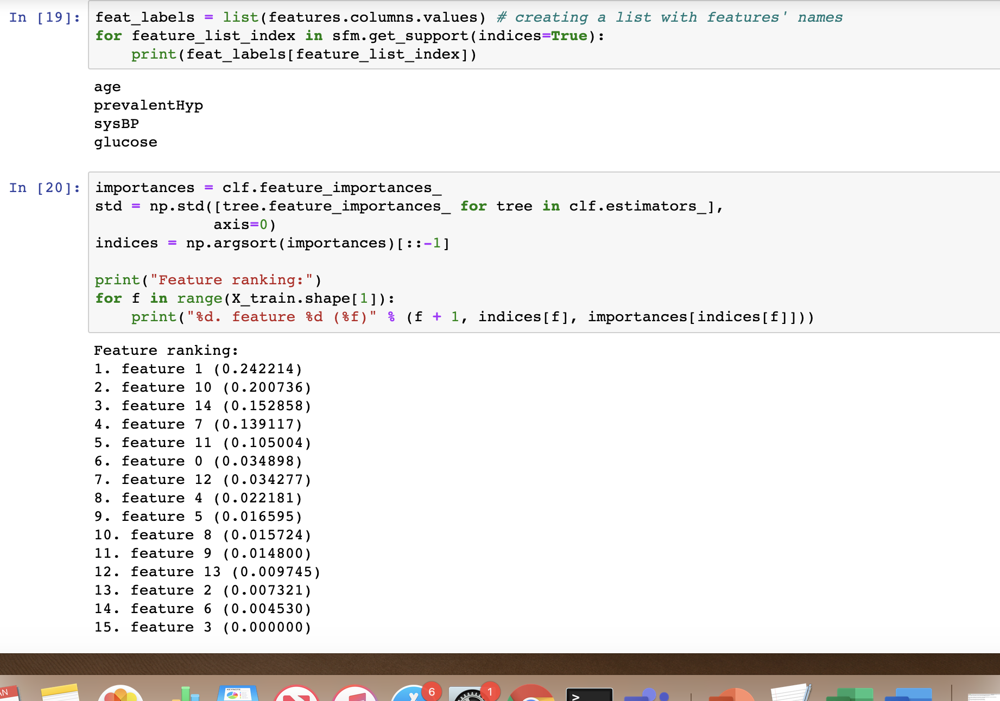
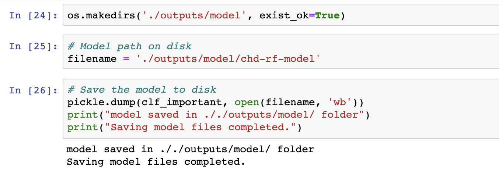

# Module 5a - The base experiment (without AML)

## About
This lab guide section covers review of a model training experiment - in one of the notebooks uploaded in the previous section.  The notebook details an entire experiment (model training).  The code is from my data scientist contact - Michael Kareev - formerly a customer contact 

## 1.0. About the dataset, framingham.csv
The dataset is framingham.csv, you downloaded it in section 2;  Its a popular Kaggle open dataset. 
https://www.kaggle.com/amanajmera1/framingham-heart-study-dataset

**Attributes/columns:**   
male: 0 = Female; 1 = Male 
age: Age at exam time 
education: 1 = Some High School; 2 = High School or GED; 3 = Some College or Vocational School; 4 = college 
currentSmoker: 0 = nonsmoker; 1 = smoker 
cigsPerDay: number of cigarettes smoked per day (estimated average) 
BPMeds: 0 = Not on Blood Pressure medications; 1 = Is on Blood Pressure medications 
prevalentStroke 
prevalentHyp 
diabetes: 0 = No; 1 = Yes 
totChol in mg/dL 
sysBP in mmHg 
diaBP in mmHg 
BMI: Body Mass Index calculated as: Weight (kg) / Height(meter-squared) 
heartRate: Beats/Min (Ventricular) 
glucose in mg/dL  

TenYearCHD - Did the person get heart disease in the 10 years study period?  
label; 0 = No for heart disease, 1 = Yes for heart disease; 

## 2.0. About the use case - Coronary Heart Disease Prediction
Given a set of attributes, predict whether a person is at risk of heart disease.

## 3.0. About the experiment
The data scientist first prepares the data/dfata engineers, then runs an ML algorithm to train the model.
The experiment is supervised learning, classification type, leveraging Scikit-Learn library.  Use case is Coronary Heart Disease Prediction with the famous Kaggle dataset - framingham.csv described above.

## 4.0. Why this notebook?
This notebook introduces the Jupyter notebook on Azure; Typically, a data scientist would run experiments here, and then collabnorate with the DevOps engineer for operationalizing the pipelines and the model as a REST service.  In the next module, you will learn how to take the code and integrate with Azure Machine Learning. 

## 5.0. Execute the notebook
1. Navigate to your Azure Machine Learning instance on the Azure portal
2. Click on "Compute" in the left navigation panel
3. Click on Jupyter service
4. Then click on the first notebook

The instructor will talk through how to use Jupyter notebook. 
The focus is not the ML experiment as much as how to integrate with Azure Machine Learning and Azure DevOps - bear this in mind. 

## 6.0. Notebook review - part 1 - load necessary packages

 

 

 

 

 

 

 

 

 

 

 

 

 

 

 

 

 

 

## Next steps
Move to the next module -> data scientist trials with AML integration.

