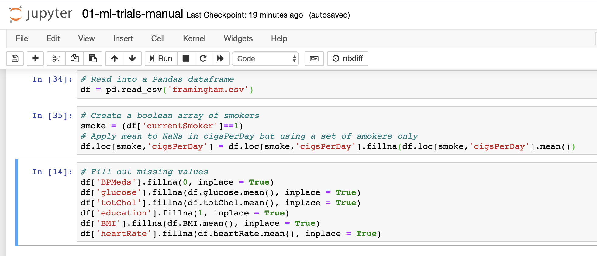

# Module 6 - The base experiment + Azure Machine Learning integration

## About
This module covers review of a model training experiment with Azure ML integration. The notebook referenced in the module is a sample you can use to show a Data Scientist how to leverage AML Service for transient training compute provisioning, model training, and registering the trained model into AML model registry. Section 8 of the notebook will be leveraged as a .py script in the DevOps pipeline.

## 1.0. The notebook...
Is 02-ml-ops-training.ipynb
You can get to it in your Jupyter environment.

## 2.0. About the use case - Coronary Heart Disease Prediction
Given a set of attributes, predict whether a person is at risk of heart disease.

## 3.0. About the experiment
The data scientist first prepares the data/dfata engineers, then runs an ML algorithm to train the model.
The experiment is supervised learning, classification type, leveraging Scikit-Learn library.  Use case is Coronary Heart Disease Prediction with the famous Kaggle dataset - framingham.csv described above.

## 4.0. Why this notebook?
This notebook introduces the Jupyter notebook on Azure; Typically, a data scientist would run experiments here, and then collabnorate with the DevOps engineer for operationalizing the pipelines and the model as a REST service.  In the next module, you will learn how to take the code and integrate with Azure Machine Learning. 

## 5.0. Execute the notebook
1. Navigate to your Azure Machine Learning instance on the Azure portal
2. Click on "Compute" in the left navigation panel
3. Click on Jupyter service
4. Then click on the first notebook

The instructor will talk through how to use Jupyter notebook. 
The focus is not the ML experiment as much as how to integrate with Azure Machine Learning and Azure DevOps - bear this in mind. 

## 6.0. Notebook review part 1 - load necessary packages

 

 

## 7.0. Notebook review part 2 - data engineering

 

 

## 8.0. Notebook review part 3 - model training

 

 

## 9.0. Notebook review part 4 - feature importance

 

 

## 10.0. Notebook review part 5 - rerun with important features only from #9

 

 

## 11.0. Notebook review part 6 - the metrics we need

 

 

## 12.0. Notebook review part 7 - the metrics from the model training

 

 

## 13.0. Notebook review part 8 - persist the model

 

 

## 14.0. Notebook review part 9 - load model and run a prediction

 

 

## 15.0. Notebook review part 10 - run multiple predictions in a call, including as called by REST service when we operationalize it

 

 

## Next steps
Move to the next module -> data scientist trials continued, this time, with AML integration.

