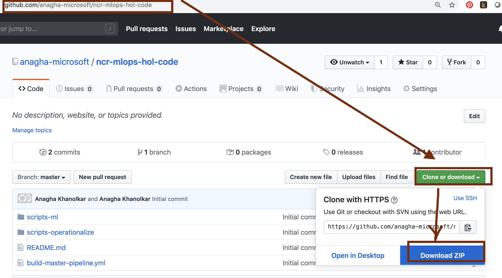
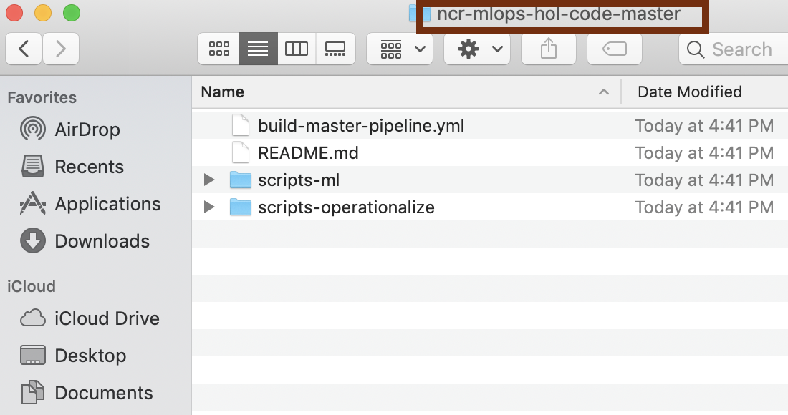
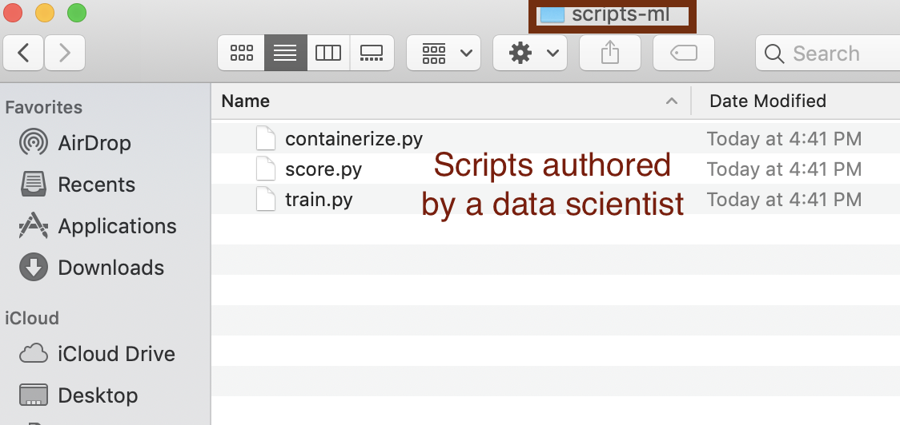
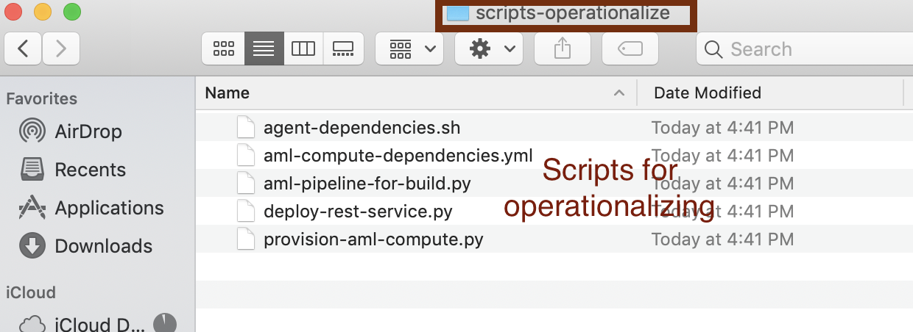

# Module 7 - Import the DevOps code from the lab git repo

## About
This module covers launching Azure DevOps UI, navigating to the repository and importing DevOps scripts for the lab (in the lab's git repo) into your Azure DevOps git repo. This module is dependent on successful creation of the Azure DevOps repo in module 1.

## 1.0. Navigate lab's git repo for the DevOps code
In the browser, go to https://github.com/anagha-microsoft/ncr-mlops-hol-code and download the code, and browse through it.  We will import this into the Azure DevOps git you created.

 

 

Browse each directory..

 

 

Browse each directory..

 

 

Browse each directory..

 

 

## 1.0. Log on to Azure DevOps...
In the browser, go to dev.azure.com and navigate to the ncr-chd-mlops project you created in module 1.

 

 

## 2.0. Click on the project...
Launch 02-ml-ops-training.ipynb.  You can get to it in your Jupyter environment, you uploaded it in a previous module.

 

 
