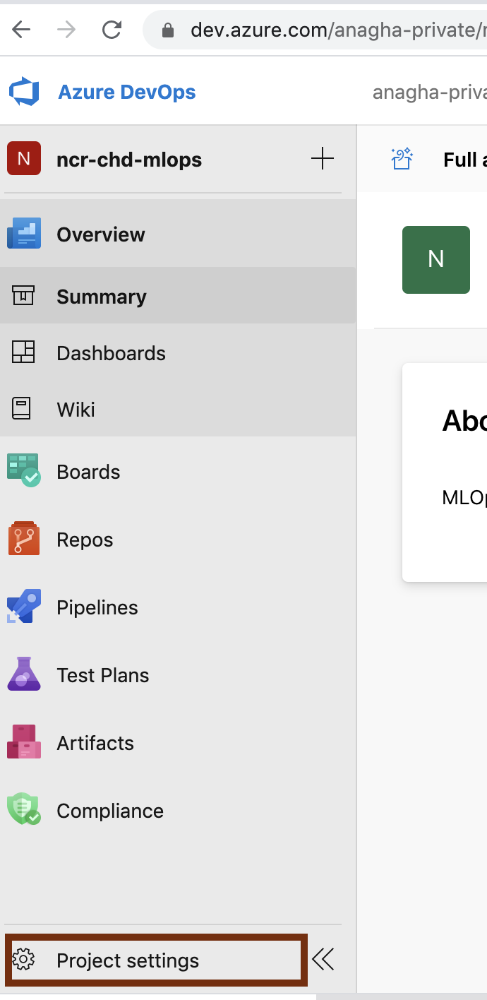
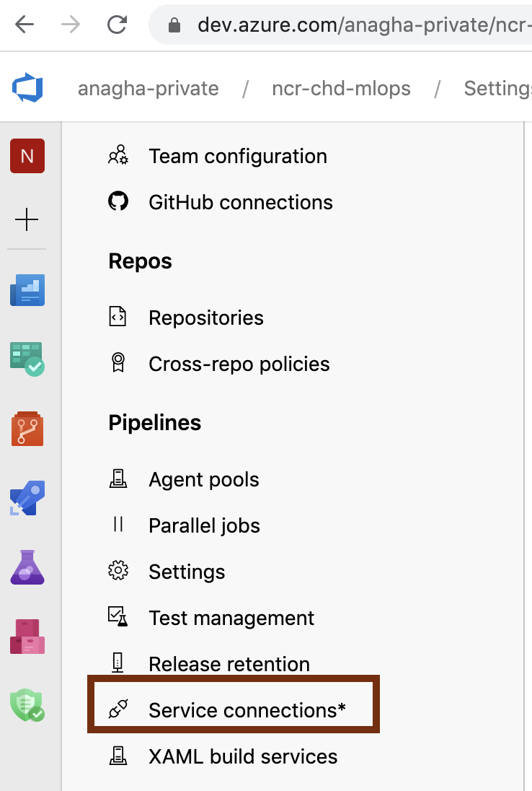
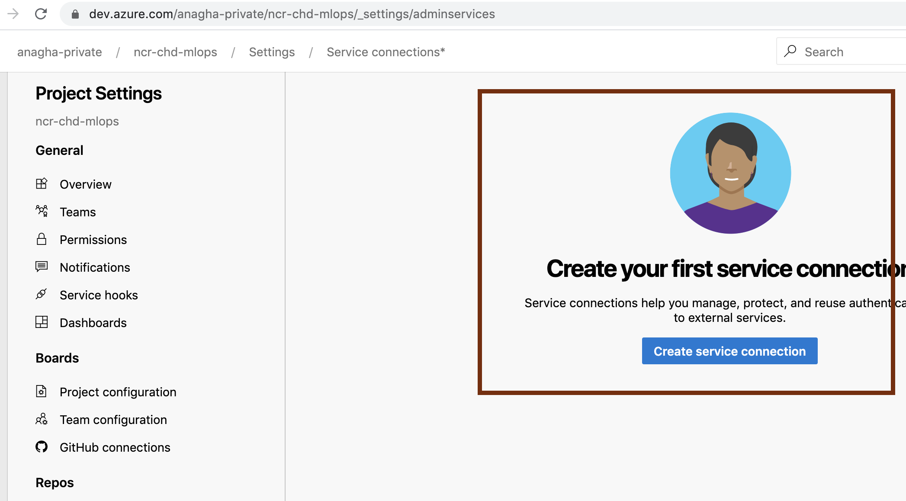
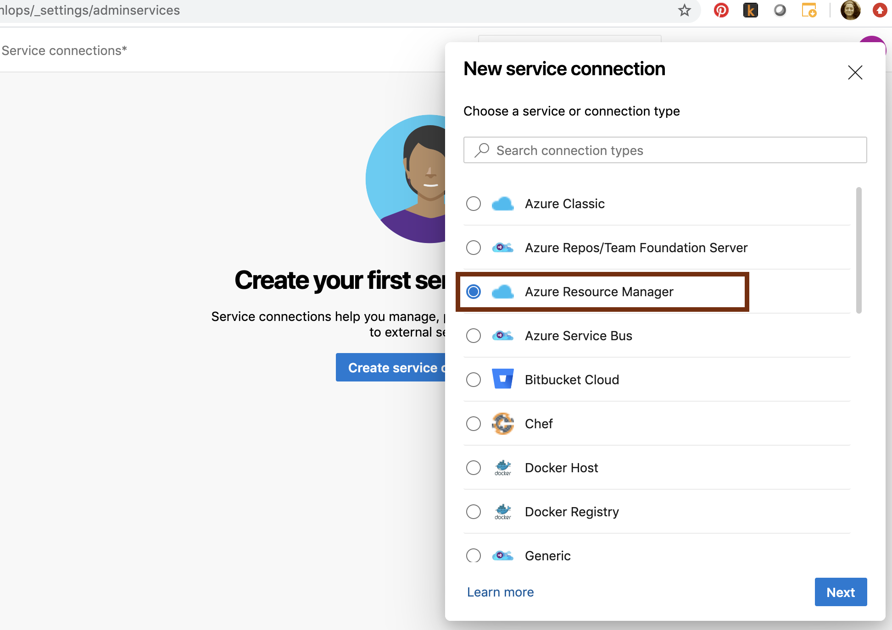
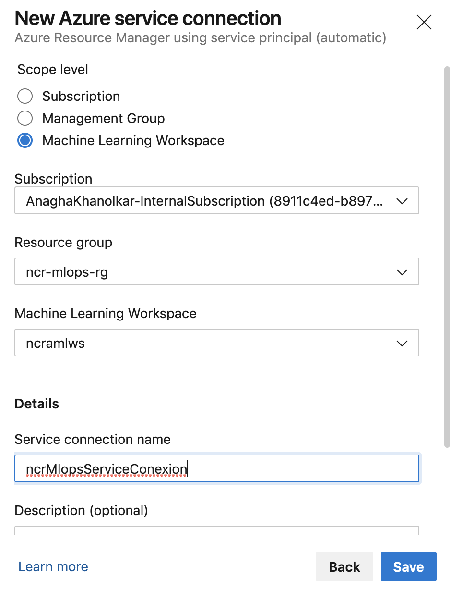
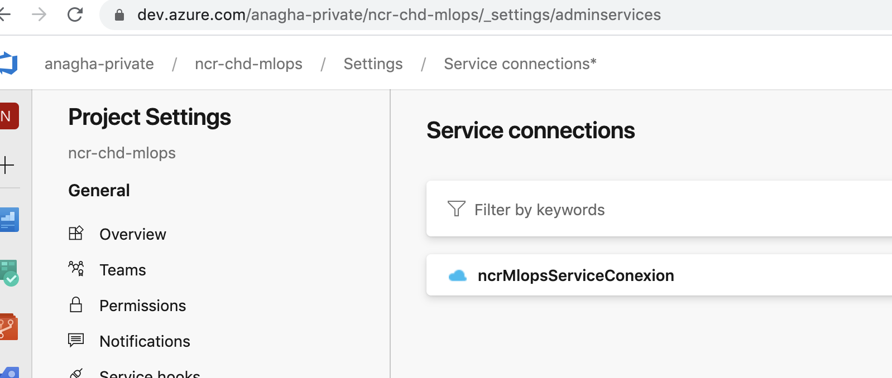

# Module 8 - Configure a service connection to your AML workspace in Azure DevOps

## About
This module covers setting up a service principal based connection to your AML workspace by Azure DevOps so the pipelines can be automated versus the manual device authentication we did in the Jupyter notebook.
  Dedicate 5 minutes for this module.

## 1.0. Navigate to project settings in Azure DevOps web UI...

 

 

## 2.0. Click on service connection

 

 

## 3.0. Click on "Create yourt first service connection"

 

 

## 4.0. Choose connection/service type of "Azure Resource Manager"

 

 

## 5.0. Select authentication method "Service Principal (automatic) - Recommended"

 

 

## 6.0. Select scope of "Azure Machine Learning workspace", select your Azure subscription, resource group and Azure Machine Learning workspace instance and enter a name for the connection (e.g. ncrMlopsServiceConexion)

Make a note of the service connection name.

 

 

## 7.0. In a couple minutes you should see your service connection created

 

 

## Recap
Its a wrap for this module.  In this module you learned to (1) create a service connection in Azure DevOps to (2) your specific AML workspace (3) leveraging a service principal for authentication, (4) for automation of authentication during the MLOps pipeline execution.

## Next steps
Move to the next module -> where you will learn about what the various scripts are in the DevOps/MLOps code you imported
 
[The MLOps code - explained](https://github.com/anagha-microsoft/ncr-mlops-hol/blob/master/lab-guide/09-DevOps-Files-Explained.md)

