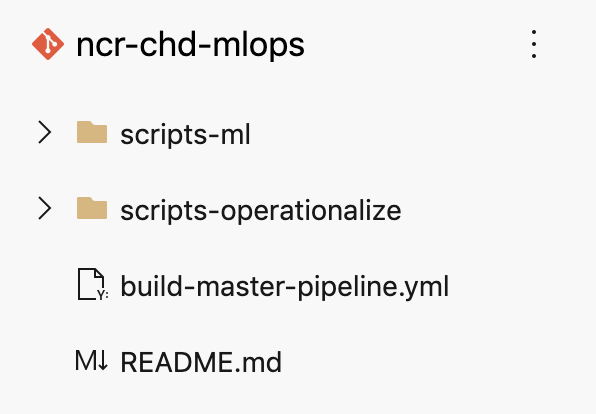
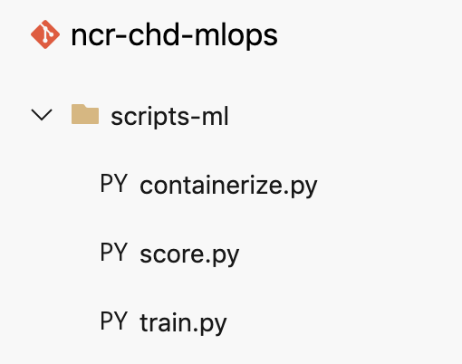
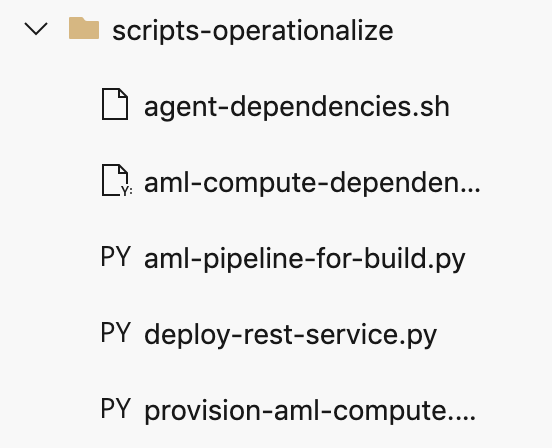

## About
This section lists what the various files are and the part each one plays in the MLOps process.  Expect to spend time to review the files independently in depth for greater understanding.

 
Suggested time committment for thorough review is 60 minutes.

## 1.  Organizational rationale

 

 

1. Code authorted by the data scientist: 
The scripts authored by the data scientists are placed in the scripts-ml directory

 

 

 

 

 

 

## 2.  build-master-pipeline.yml (Build pipeline YAML)
1.  This is a script authored by the DevOps engineer typically 
2.  It describes trigger for the pipeline, variables and pipeline steps in the order to be executed - it calls additional scripts to be executed. 

## 2.  train.py (Model training script)
1.  This script is authored by the data scientist
2.  It trains the model and checks it into the AML model registry. 
3.  It is called in the build pipeline

## 3.  containerize.py (Conatiner image creation script)
1.  This script is authored by the data scientist
2.  It creates a docker container with dependencies and model packed in and checks it into the AML container registry
3.  It is called in the build pipeline

## 4.  containerize.py (Conatiner image creation script)
1.  This script is authored by the data scientist
2.  It creates a docker container with dependencies and model packed in and checks it into the AML container registry
3.  It is called in the build pipeline

## Recap
Its a wrap for this module.  In this module you learned to ...

## Next
Navigate to the next module where you will learn to create and execute a build pipeline
 
[Configure and test a build pipeline](https://github.com/anagha-microsoft/ncr-mlops-hol/blob/master/lab-guide/10-Configure-Build-Pipeline.md)

