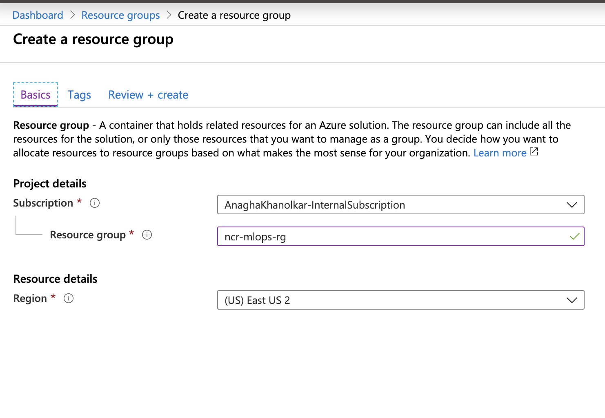
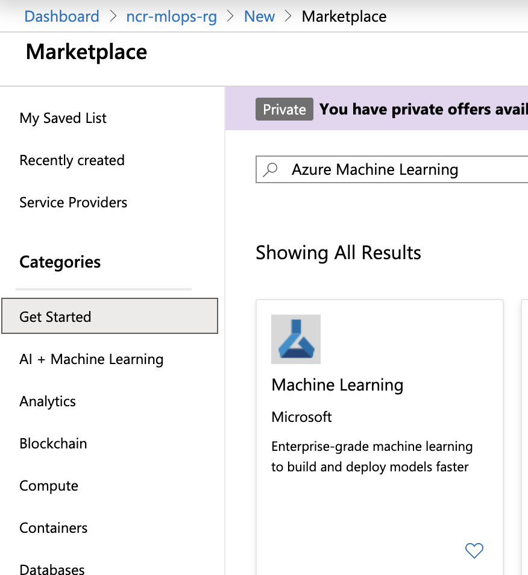
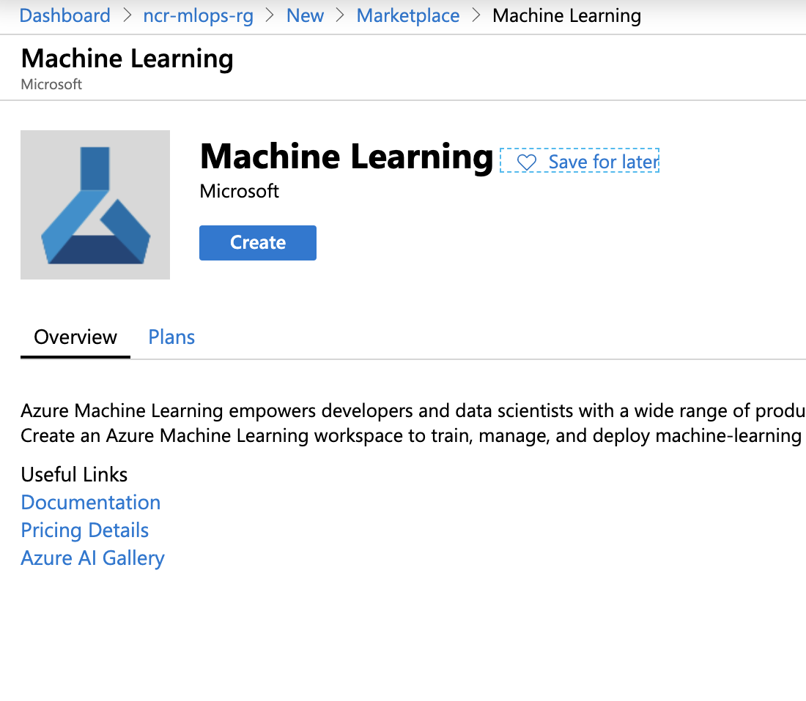
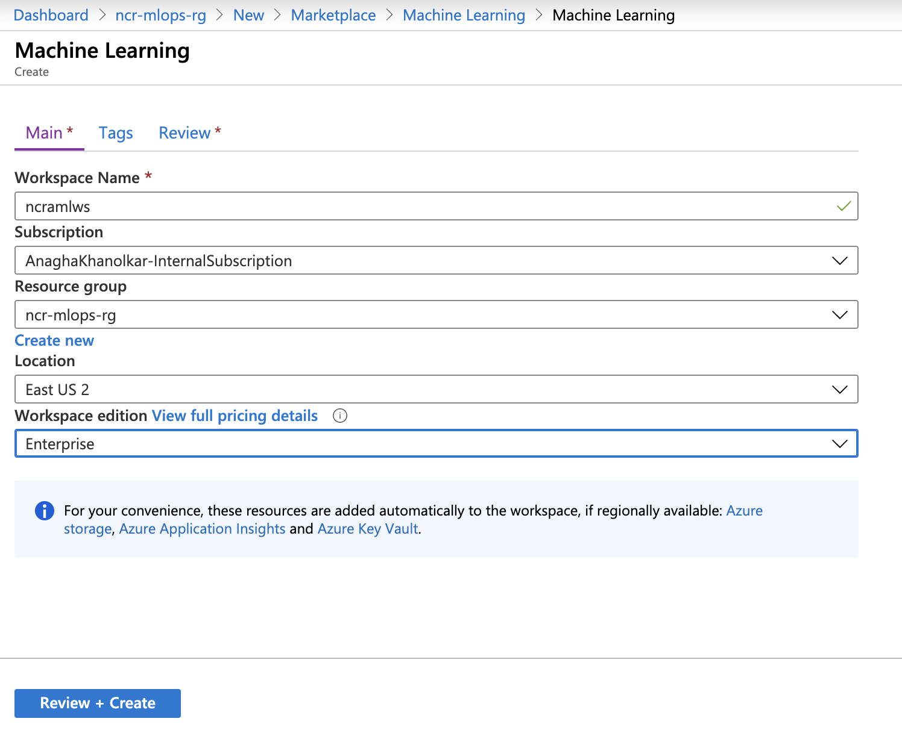
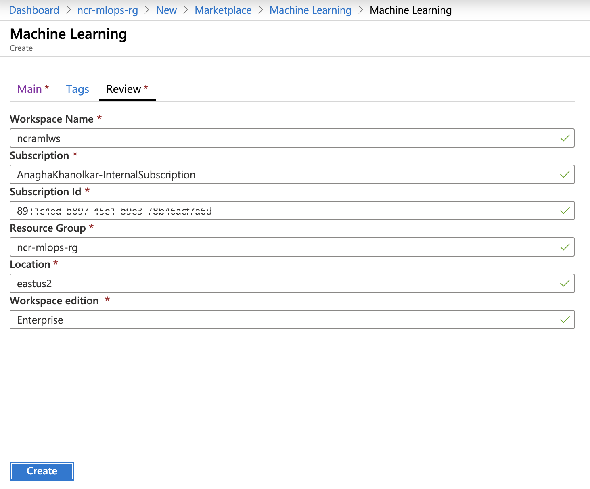

## About
This lab guide section covers provisioning of resources for the lab.  Please follow the steps carefully, and sequentially to ensure you dont run into issues.

## 1.0. Provision a resource group
1. Logon to the Azure portal (portal.azure.com), and sign-in to your Azure subscription 
2. Create a resource group as shown in the screenshots below 

 

## 2.0. Provision an Azure Machine Learning Service instance
1.  Navigate into the resource group from #1.0.2 above 
2.  Click on "+ Add" and type "Azure Machine Learning" 
3.  Follow the steps below to provision the service 

 

 

 

 

