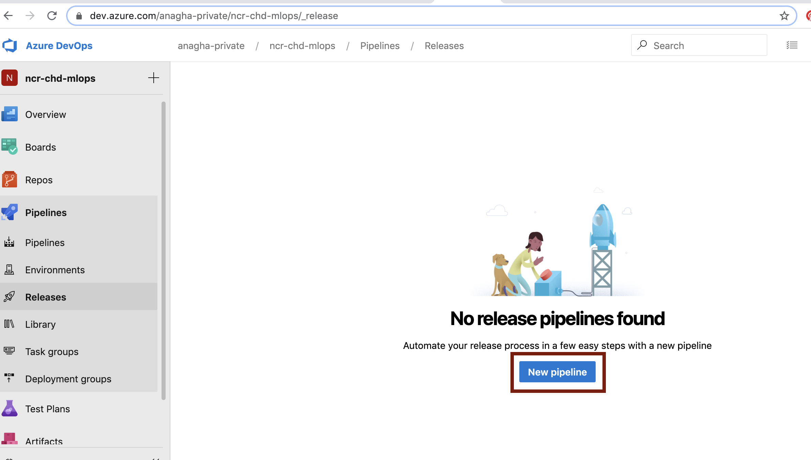
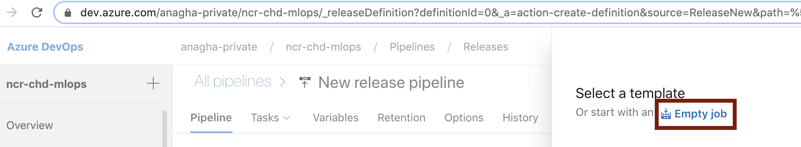
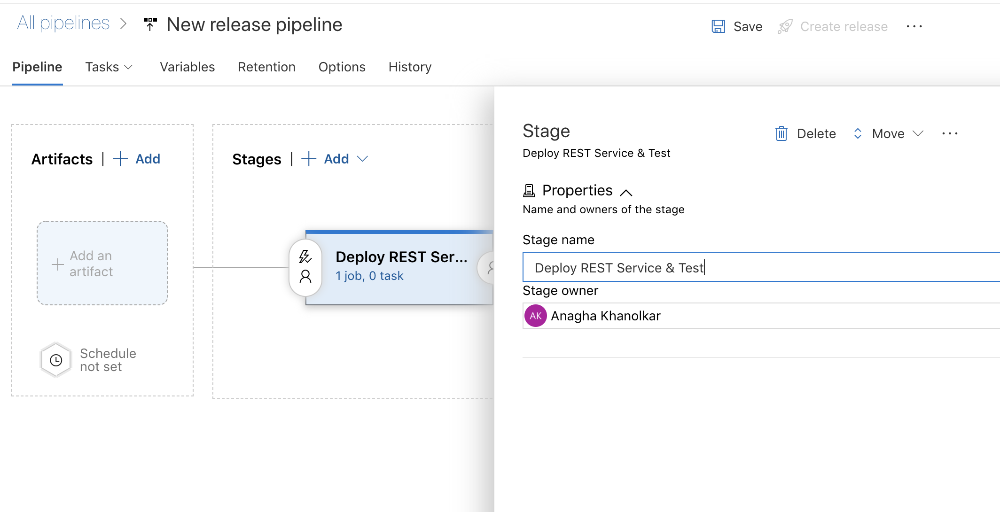

# Module 11 - Configure and run the release pipeline in Azure DevOps

## About
This module covers configuring a release pipeline and executing it.  It also covers study of the AML assets created as part of the pipeline execution.
  Dedicate 60-90 minutes for this module - to thoroughly understand and execute

## 1.0. Create a release pipeline in Azure DevOps

1) Create a new release pipeline by clicking on the button

 

 

2) Click on "Empty job"

 

 

3) Click on "Empty job"

 

 

## Recap
Its a wrap for this module.  You now know how to (1) ..

## Next steps
Move to the next module -> this covers testing the REST service operationalized as part of the release pipeline, manually, in a Jupyter notebook
