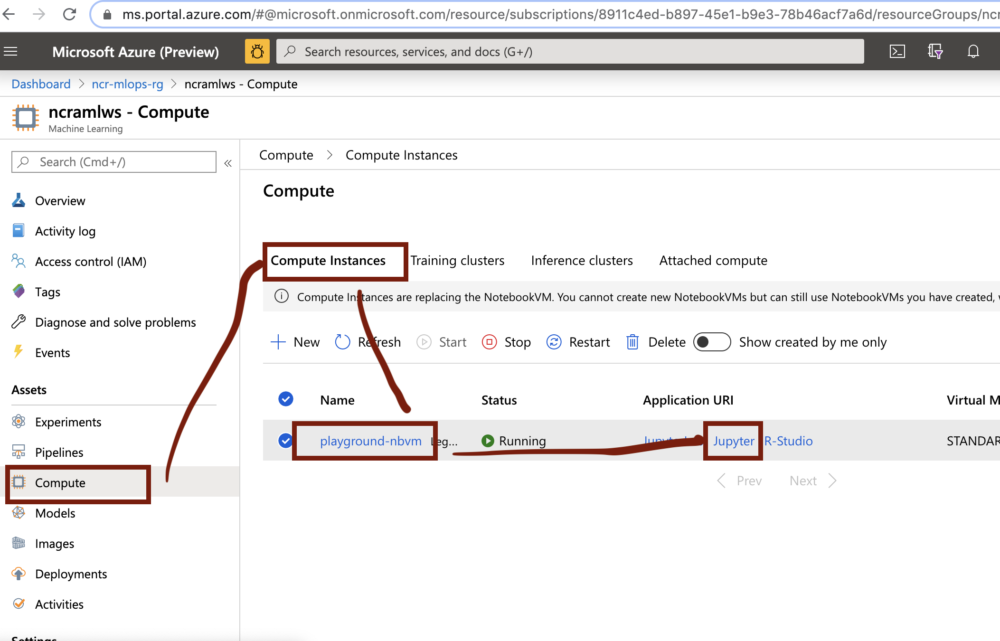
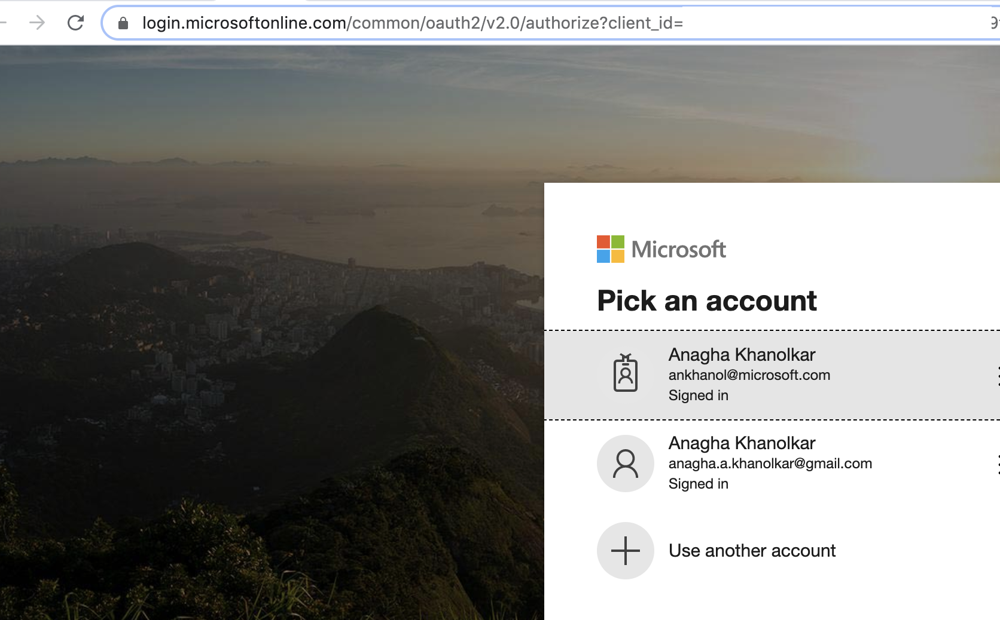
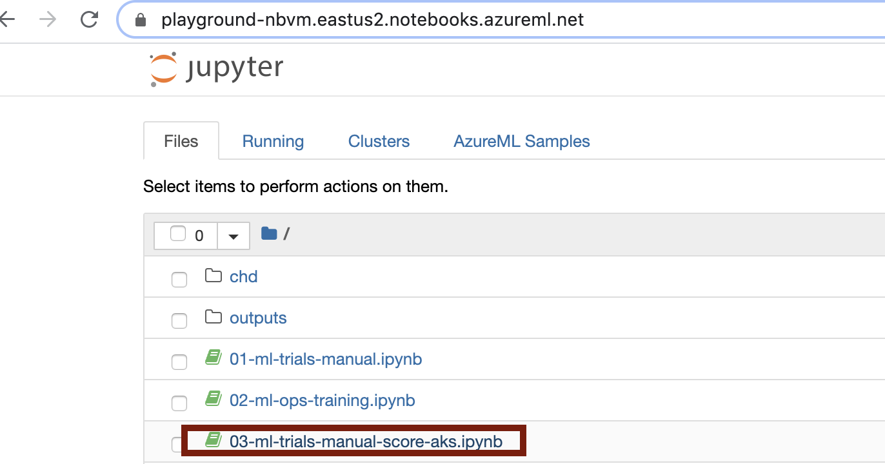
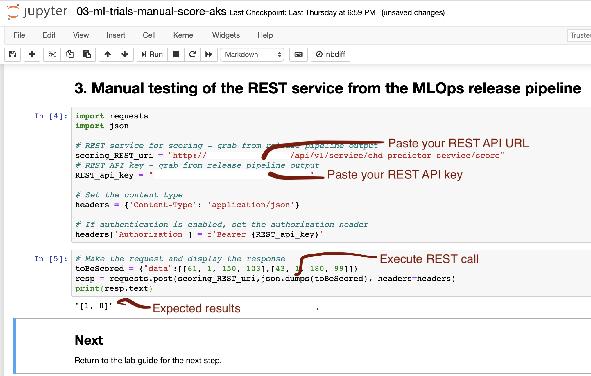

# Module 12 - Test the REST API manually from a Jupyter notebook

## About
This module covers testing a REST call of the model operationalized in previous step.  You will need the REST API URL and the REST API key for this module.

  Dedicate 10 minutes for this module.

## 1.0. Launch Jupyter from the portal

1) Navigate in the portal to your notebook VM and launch Jupyter

 

 

2) Log in

 

 

3) Click on the third notebook, 03-ml-trials-manual-score-aks.ipynb

 

 

4) Paste your REST service details, and execute the two cells, one at a time; You should see the expected results in the screenshot

 

 

## Recap
Its a wrap for this module. You now know how to test your REST API in Jupyter to ensure its working correctly.

## Next steps
Move to the next module -> this covers running an end to end pipeline (build to release)
 
[Lets do an End-to-End run (build + release)](https://github.com/anagha-microsoft/ncr-mlops-hol/blob/master/lab-guide/13-EndToEndRun.md)

