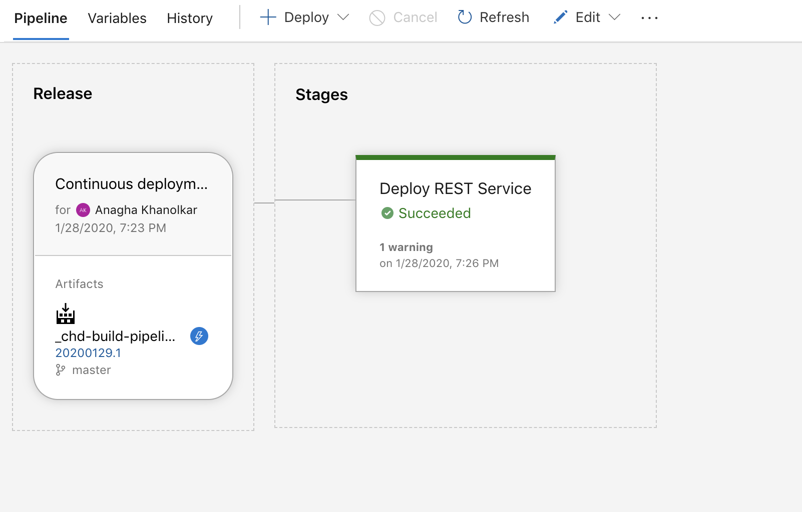

# Module 12 - Test the REST API manually from a Jupyter notebook

## About
This module covers testing a REST call of the model operationalized in previous step.  You will need the REST API URL and the REST API key for this module.

  Dedicate 10 minutes for this module.

## 1.0. Launch Jupyter from the portal

1) 

 

 

2) 

 

 

3) 

 

 

4) 

 

 

5) 

 

 

6) 

 

 
