# Module 13 - Execute a continuous deployment (e2e run)

## About
This module covers cleaning up your workspace, editing the code, and committing to master -> this triggers an end to end, build to release pipeline.  This will help us ensure everything works as expected from a continuous deployment perspective.  Lets do this lab twice and observe how the release pipeline differs the second time around in the logs. 

For your pleasure, there are challenges at the end of the module.
  Dedicate 60-90 minutes for this module - to thoroughly understand and execute

## 1.0. Clean up resources in Azure ML workspace

1) Delete any prior deployment
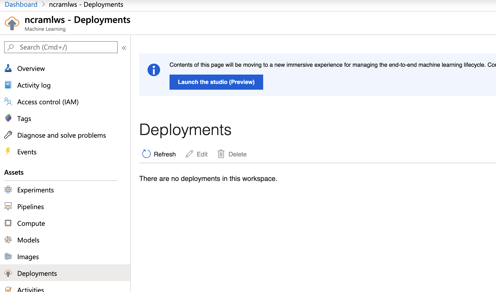
 

 

2) Delete any prior images
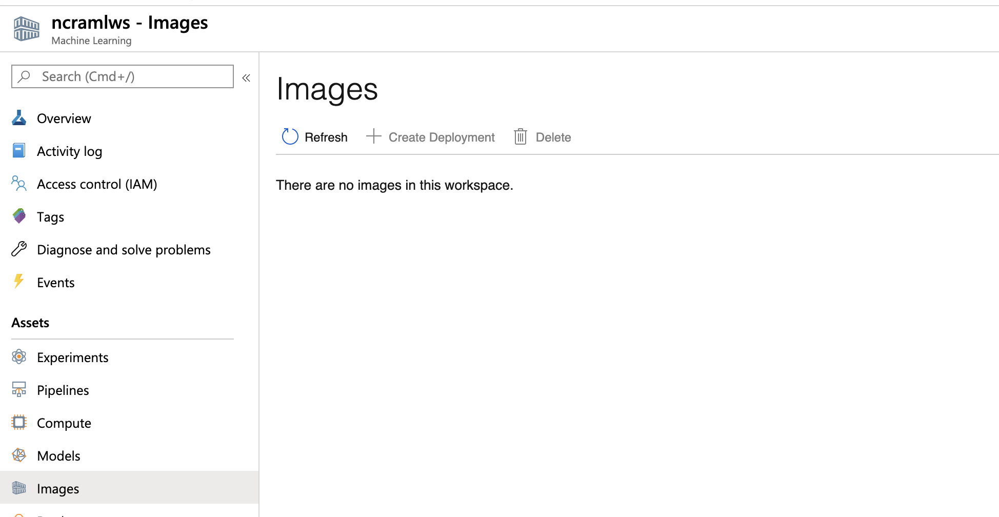
 

 

3) Delete any prior models
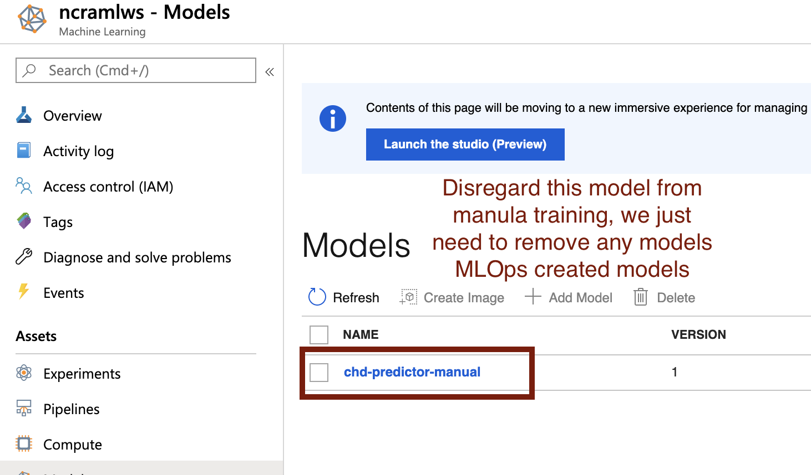
 

 

4) Delete any training compute (not manual)
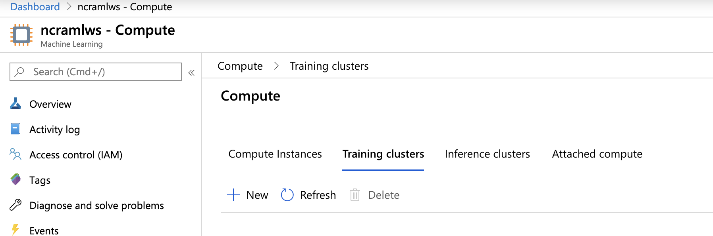
 

 

5) Delete any inference compute, wait till it shows complete deletion
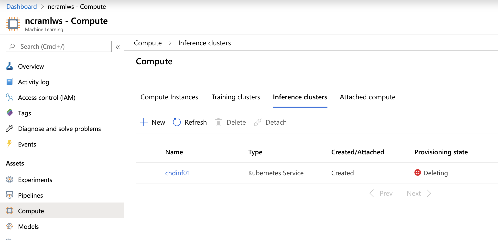
 

 

## 2.0. Modify code in your DevOps git and commit to master to trigger a build pipeline

1) Go to deploy-rest-service.py, line 188 and add two periods are the very end
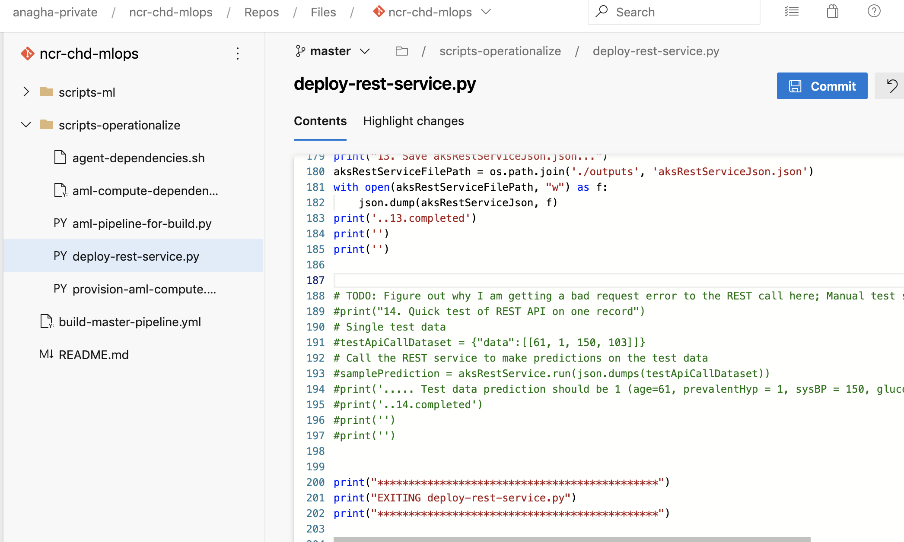
 

 

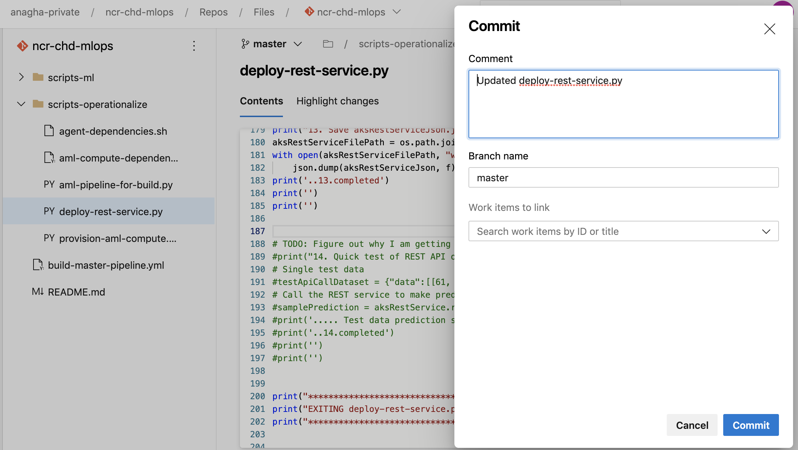
 

 

## 3.0. Monitor the build pipeline through completion (30-40 minutes - take a power nap/break)
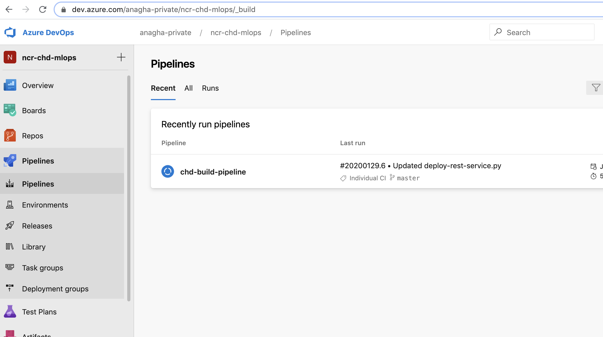
 

 

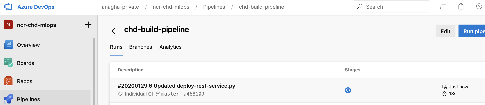
 

 

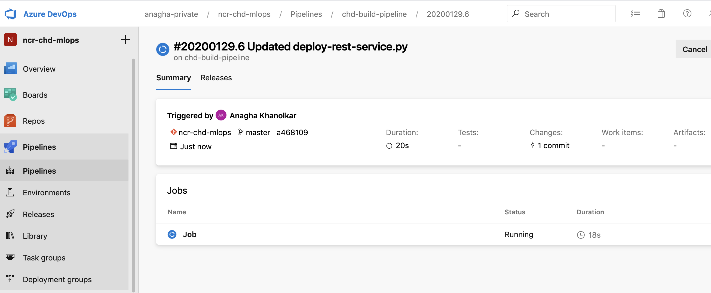
 

 

Build should complete successfully!
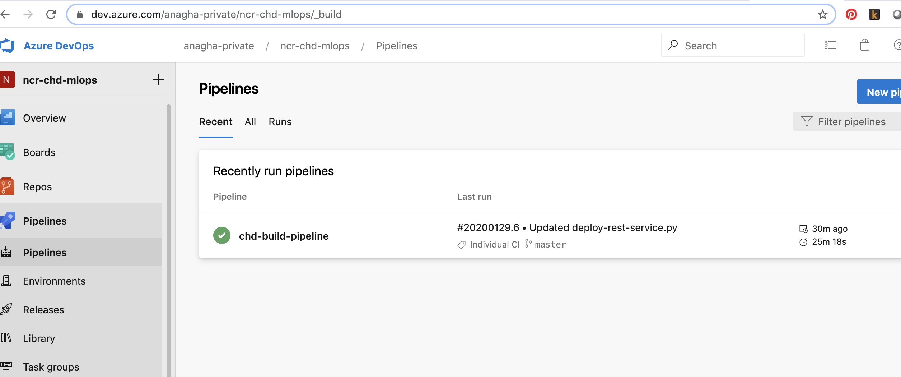
 

 

Check the Azure portal - AML workspace to ensure you see the AML assets getting provisioned/created/registered

## 4.0. Monitor the release pipeline through completion (30-40 minutes - take a power nap/break)

1) Release should start automatically!

 

 

2) In progress...

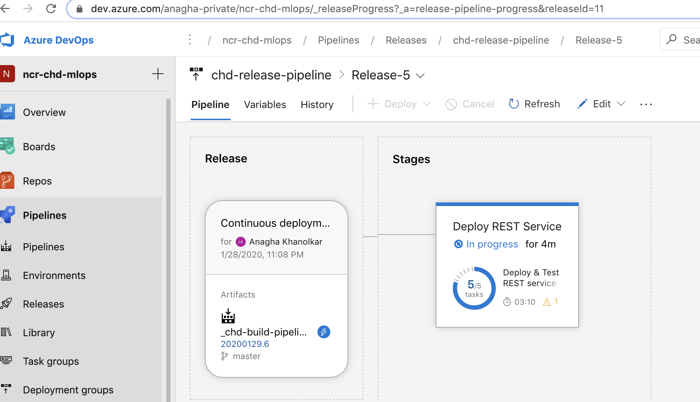
 

 

3) Deploy and test REST service...

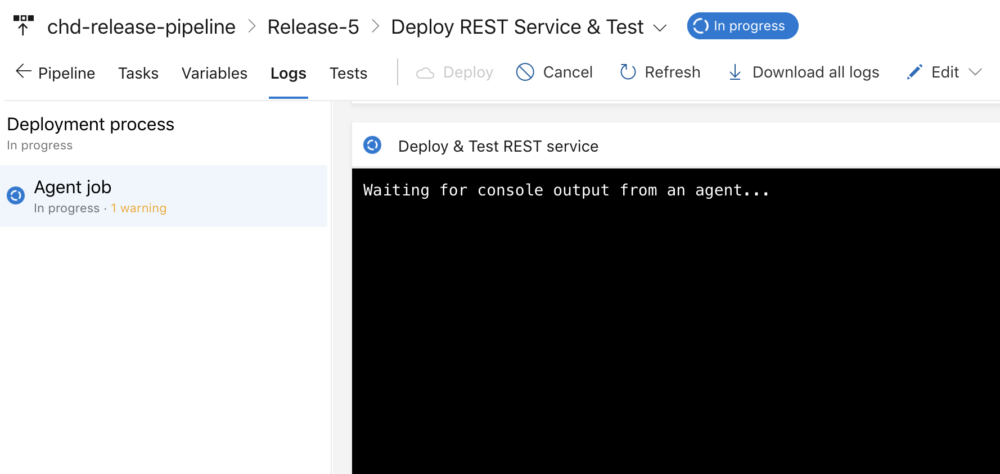
 

 

4) Completion...

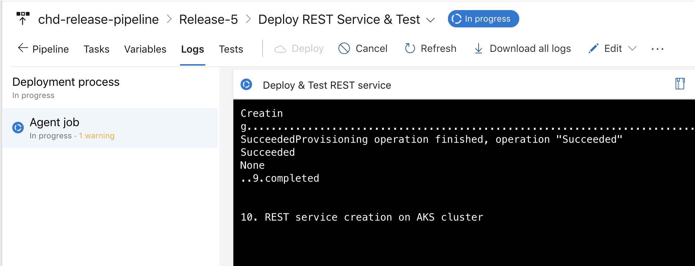
 

 

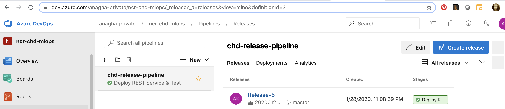
 

 

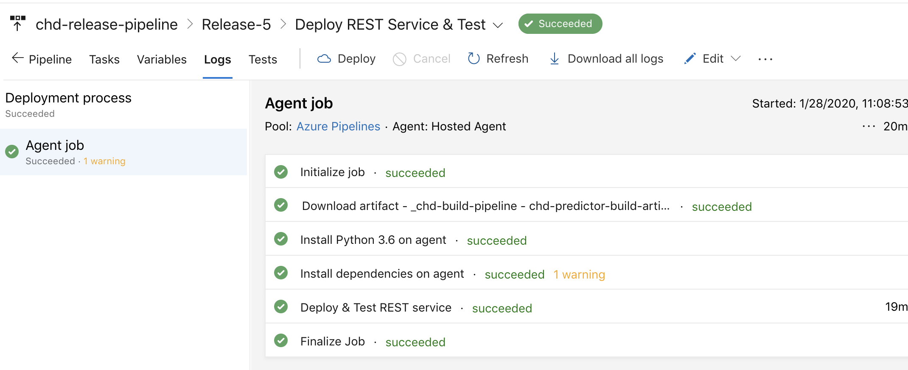
 

 

## 5.0. Run it again - from step 2
Discuss/explore what is different with the second run in this module.

## 6.0. Challenge - 1
In the script, deploy-rest-service.py, fix this piece of code that is commented out; You should be able to test the REST API as part of the script 

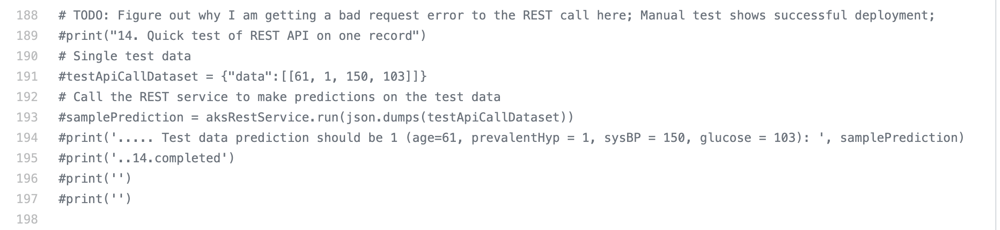
 

 

## 7.0. Challenge - 2
2) Navigate to Jupyter on the portal in your AML workspace, and run through the notebook, 04-ml-trials-model-telemetry.ipynb 
This enables telemetry and does some sample REST calls to collect some data for telemetry analysis

## 8.0. Challenge - 3
Run through this documentation and explore your model telemetry
https://docs.microsoft.com/en-us/azure/machine-learning/how-to-enable-data-collection

## Recap
In this module, you learned how modified code triggers a continuous build + release pipeline.  You noticed what happens from a REST service perspective with repeated runs.

## Next
This last module speakes to what else is available in AML and MLOps that was not included in the lab for scope management.  

