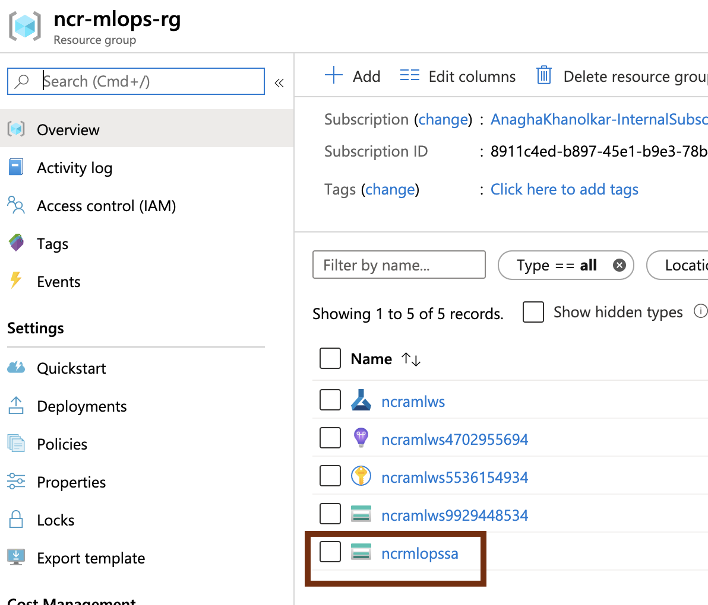
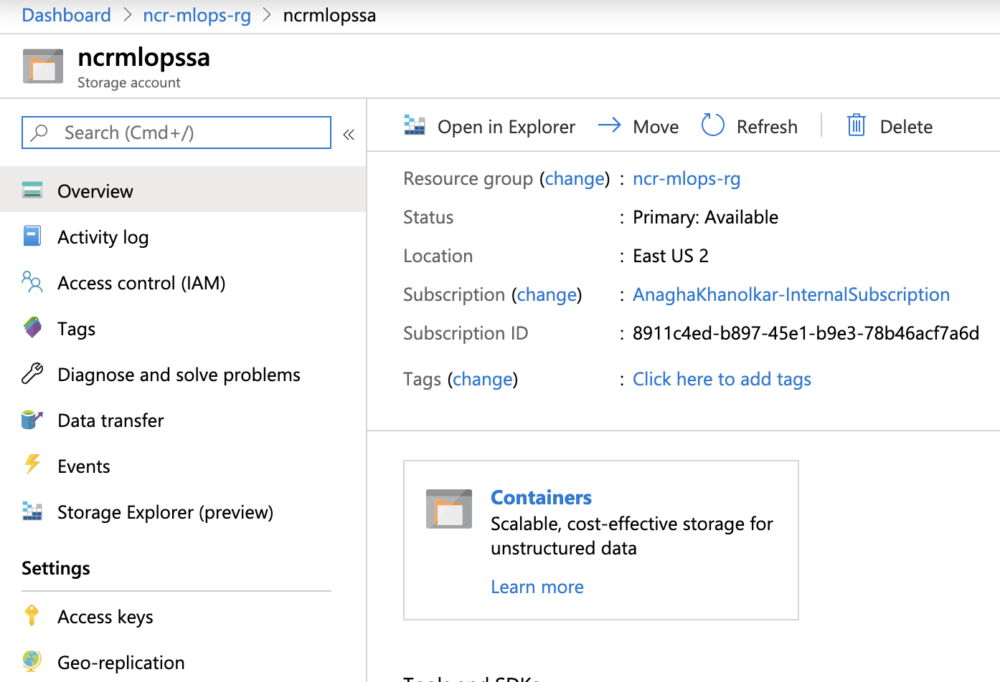
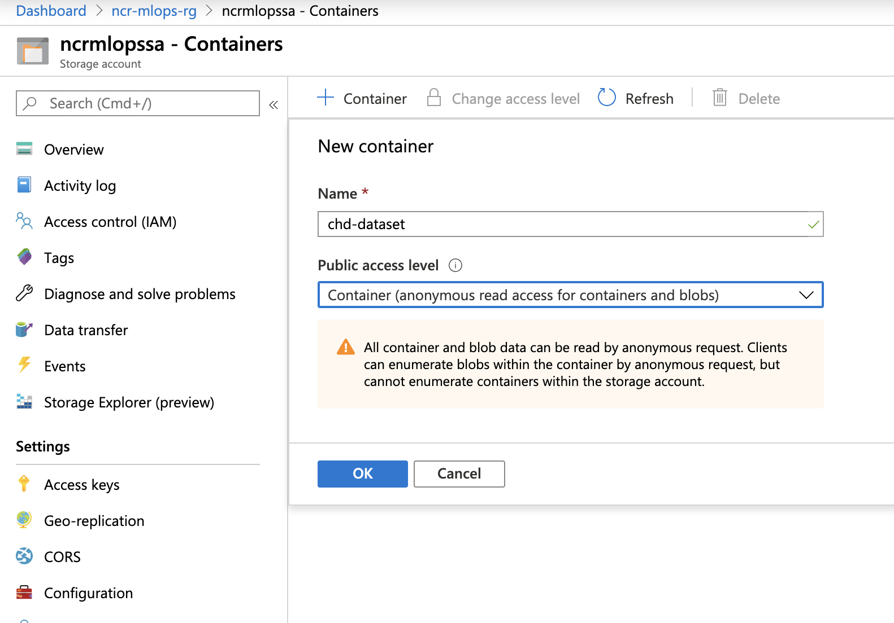
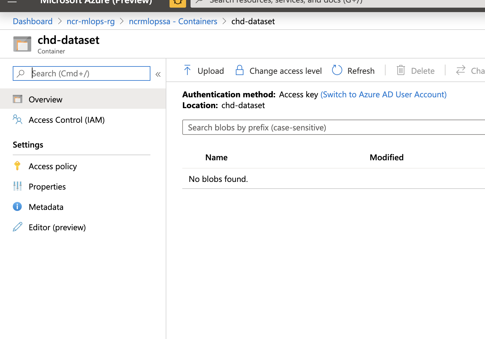

## About
This lab guide section covers loading training data to your storage account.
 

## 1.0. Create a container in your storage account
1. Navigate to the storage account on the portal
2. Create a conatiner as shown in the screenshots below 

 

 

 

 

 

 

 

 

 

 
